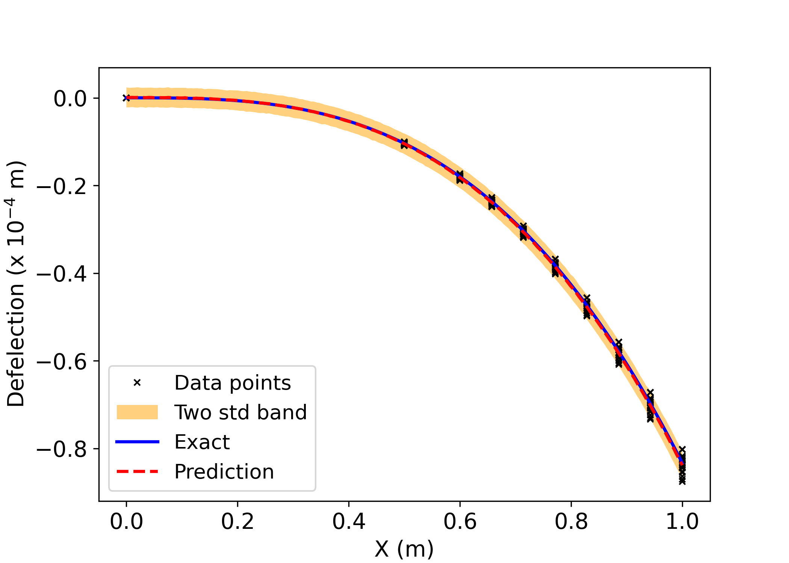

## UQPINNS+GANS
<div align="center">
  
</div>


&nbsp;\
**Uncertainty Quantification with Adversarial Physics-Informed Neural Networks**
> Submitted as a final project for the "Introduction to Deep Learning (ELEC/COMP 576)" course at Rice University.

&nbsp;\
The primary objective of this project is to develop and
train an adversarial neural network framework combined
with Physics-Informed Neural Networks (PINNs) to identify
and quantify errors in complex physical systems.


### Experimental Results
We demonstrated the use of PINNs + GANS on a simpe engineering problem, specifically 
to investigate the uncertainties of cantilever beam with uncertain material properties and deflection.
For more detaills, check out our notebooks for the two experiments reported here:
[Experiment 1](./UQPINNs_EX2_BC.ipynb) and [Experiment 2](./UQPINNs_EX2_E.ipynb).


### Citations

This work is based on these papers:
```
@inproceedings{Goodfellow2014gan,
  title={Generative Adversarial Nets},
  author={Ian J. Goodfellow and Jean Pouget-Abadie and Mehdi Mirza and Bing Xu and David Warde-Farley and Sherjil Ozair and Aaron Courville and Yoshua Bengio},
  booktitle={Advances in Neural Information Processing Systems},
  volume={27},
  year={2014},
  url={https://proceedings.neurips.cc/paper/2014/hash/5ca3e9b122f61f8f06494c97b1afccf3-Abstract.html}
}

@article{Yang2019adversarial,
  title={Adversarial uncertainty quantification in physics-informed neural networks},
  author={Yibo Yang and Paris Perdikaris},
  journal={Journal of Computational Physics},
  volume={394},
  pages={136--152},
  year={2019},
  publisher={Elsevier}
}
```

### The Team
The team consist of a group of PhD students from the Uncertainity Quantification Lab at the
University of Houston; all of whom are enrolled in the ELEC/COMP 576 course at Rice University:

- Akash Yadav
- Taiwo A. Adebiyi
- Nafeezat Ajenifuja
